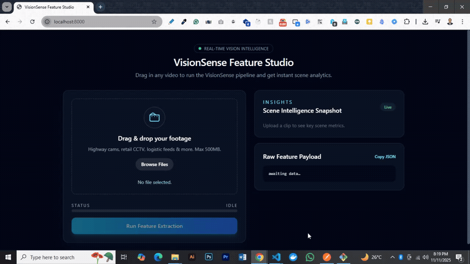
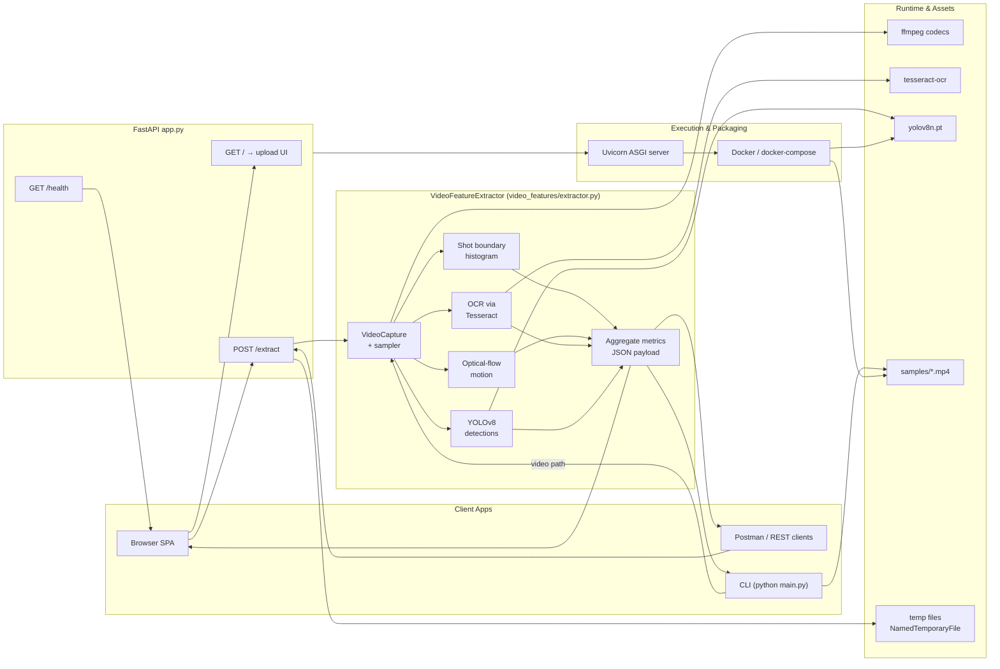

# VisionSense.ai


An intelligent, feature-rich **video analysis and extraction platform** that automatically detects motion, scene cuts, text, and object/person ratios in any video.  
Designed for **high scalability**, **modularity**, and **extensibility**, built using modern Python and FastAPI architecture.

> 🧠 Originally inspired by the **White Panda Video Feature Extraction assignment**,
> that inspects a local video and summarizes key structural, temporal, and semantic traits.
> This implementation, improvements, and complete codebase are **authored and maintained by [Shaon Majumder](https://github.com/ShaonMajumder)**.

<p align="center">
  <a href="#features">Features</a> •
  <a href="#assignment-overview">Assignment</a> •
  <a href="#demo">Demo</a> •
  <a href="#tech-stack">Tech Stack</a> •
  <a href="#how-to-run">How to Run</a> •
  <a href="#setup">Setup</a> •
  <a href="#architecture">Architecture</a> •
  <a href="#implementation-notes">Implementation</a> •
  <a href="#performance">Performance</a> •
  <a href="#performance-tuning-knobs">Tuning</a> •
  <a href="#troubleshooting">Troubleshooting</a> •
  <a href="#credit">Credit</a> •
  <a href="#license">License</a>
</p>

---

## 🎯 Features <a id="features"></a>

- **🎬 Shot Cut Detection** – Detects scene transitions using Bhattacharyya distance between HSV histograms.
- **🎞 Motion Analysis** – Uses Farneback Optical Flow to compute average motion magnitude.
- **🔠 Text Detection (OCR)** – Identifies on-screen text using Tesseract OCR.
- **🧍 Person vs. Object Detection** – Employs YOLOv8 for semantic ratio calculation.

**Engineering & Runtime**

- **⚡ Real-Time Processing** – Efficient processing pipeline via OpenCV and NumPy.
- **🧰 Extensible Design** – Modular structure for easy feature addition.
- **⚙️ Env-Driven Configuration** – No code edits required for production tuning via `.env`.
- **🐳 Dockerized Runtime** – Fully reproducible and cross-platform container build.
- **🔄 Stream Processing** – Decodes and processes videos frame-by-frame for efficiency.
- **📦 Per-Video Temp Isolation** – Each upload is isolated within a secure temporary volume.
- **🧱 Quota Enforcement** – Enforces upload size, volume usage, and free-space safety constraints to ensure stability.

---

## 📋 Assignment Overview <a id="assignment-overview"></a>

**Task:** Build a **Video Feature Extraction Tool** that analyzes a local video and outputs visual + temporal insights. **— ✅ Completed**

**Core Requirements**

- ✅ **Input:** Local video file path
- ✅ **Processing:** Use OpenCV (and `pytesseract`) to compute metrics
- ✅ **Output:** Structured JSON or dictionary of extracted features

**Required Features**

1. ✅ **Shot Cut Detection** — detects scene transitions
2. ✅ **Motion Analysis** — computes average motion (Farnebäck optical flow)
3. ✅ **Text Detection (OCR)** — measures on-screen text ratio
4. ✅ **Person vs. Object Ratio** — via YOLOv8 detections

**Deliverables**

- ✅ Python CLI/Script for feature extraction
- ✅ README with setup and usage details

**Timeline:** 36-hour turnaround

---

## 🚀 Demo <a id="demo"></a>

### 🎥 Video Feature Extraction Overview

**Figure:** 🌐 FastAPI Web Interface: VisionSense extracting scene cuts, motion, and OCR text


- Processes local video files.
- Detects scene cuts, motion, on-screen text, and object/person ratios.
- Outputs structured JSON results.

### Key Highlights

- Upload videos from your browser.
- Instantly view extracted feature JSON.
- Powered by FastAPI + Uvicorn.

---

## 🧰 Tech Stack <a id="tech-stack"></a>

| **Area**             | **Technology Used**           | **Purpose**                               |
| -------------------- | ----------------------------- | ----------------------------------------- |
| **Language**         | Python 3.11+                  | Core implementation                       |
| **Backend**          | FastAPI                       | REST API service for video analysis       |
| **Web Server**       | Uvicorn                       | ASGI server to host the API               |
| **Computer Vision**  | OpenCV                        | Frame processing, histogram, optical flow |
| **OCR**              | Tesseract OCR (`pytesseract`) | Extract on-screen text                    |
| **Object Detection** | YOLOv8 (`ultralytics`)        | Detect people vs. objects                 |
| **Math Library**     | NumPy                         | Vectorized operations                     |
| **Video Tools**      | FFmpeg                        | Video decoding and conversion             |
| **Containerization** | Docker & Docker Compose       | Reproducible builds                       |

---

## 🌐 How to Run <a id="how-to-run"></a>

### 💻 Using CLI <a id="cli"></a>

Run the tool directly from the command line:

```bash
python main.py --video samples/people-at-work.mp4 --output samples/features.json
```

**Optional Parameters:**

- `--frame-stride` → process every Nth frame (default 5)
- `--shot-threshold` → histogram distance for detecting cuts (default 0.45)
- `--text-sample-stride` → OCR cadence (default 10)
- `--yolo-frame-stride` → YOLO sampling rate (default 15)
- `--yolo-model` → custom YOLO checkpoint (default `yolov8n.pt`)

---

### 🎥 Sample Videos <a id="samples"></a>

| **Feature**                     | **Example Video(s)**                       | **Description**                                 |
| ------------------------------- | ------------------------------------------ | ----------------------------------------------- |
| **Motion Detection**            | `people-walking.mp4`, `people-at-work.mp4` | Tests optical flow–based motion magnitude.      |
| **Text Detection (OCR)**        | `text-scene.mp4`                           | Validates OCR accuracy and text presence ratio. |
| **Scene Cut Detection**         | `movie-trailer.mp4`                        | Measures abrupt visual transitions (hard cuts). |
| **Object vs. Person Dominance** | `highway-traffic-cctv.mp4`                 | Evaluates YOLOv8 person/object ratio.           |

All test videos are available under `samples/`.

---

### Using Docker

```bash
docker compose up --build
```

This will build and start the service.
You can then access the FastAPI app at [http://localhost:8000](http://localhost:8000).

---

### Using directly command line with Uvicorn

```bash
uvicorn app:app --host 0.0.0.0 --port 8000
```

Visit [http://localhost:8000](http://localhost:8000) → upload a video → view extracted features in JSON.

---

### 📊 Example Output <a id="output"></a>

```json
{
  "video_path": "samples/highway-traffic-cctv.mp4",
  "duration_seconds": 12.3,
  "frames_total": 300,
  "frames_processed": 60,
  "hard_cuts": 3,
  "avg_motion_magnitude": 0.21,
  "text_present_ratio": 0.02,
  "people_detections": 4,
  "object_detections": 42,
  "person_to_object_ratio": 0.09
}
```

These metrics can be consumed programmatically for downstream ranking or filtering pipelines.

---

## Setup <a id="setup"></a>

### Manual Installation Guide — VisionSense.ai (Windows)

This guide walks you through installing all dependencies **manually** on **Windows**, without running scripts.

---

### 1️⃣ Install Python 3.11 (or latest 3.x)

1. Visit the official Python downloads page:
   🔗 [https://www.python.org/downloads/windows/](https://www.python.org/downloads/windows/)
2. Download the **Windows Installer (64-bit)** for **Python 3.11** (or newer 3.x version).
3. During installation:

   - ✅ Check **“Add Python to PATH”**
   - Click **Customize installation** → Keep default options → Finish.

4. Verify installation:

   ```bash
   python --version
   ```

   Expected output: `Python 3.11.x`

---

### 2️⃣ Install FFmpeg via winget

Use the **Windows package manager (winget)**:

```powershell
winget install --id FFmpeg.FFmpeg --source winget
```

Verify:

```bash
ffmpeg -version
```

Expected output should show FFmpeg version info.

If you don’t have `winget`, install **App Installer** from the Microsoft Store first.

---

### 3️⃣ Install Tesseract OCR (Windows build)

Use **winget** for the UB Mannheim Tesseract build:

```powershell
winget install --id UB-Mannheim.TesseractOCR --source winget
```

Alternatively, download manually:
🔗 [https://github.com/UB-Mannheim/tesseract/wiki](https://github.com/UB-Mannheim/tesseract/wiki)

After installation, verify path:

```bash
tesseract -v
```

Expected output should display Tesseract version.

If `tesseract` isn’t recognized, add this to PATH manually:

```
C:\Program Files\Tesseract-OCR
```

(Optional) Set environment variable for Python OCR:

```powershell
setx TESSERACT_CMD "C:\\Program Files\\Tesseract-OCR\\tesseract.exe"
```

---

### 4️⃣ Install Project Dependencies

Once Python and pip are installed:

1. Open PowerShell or CMD in your project directory.
2. Run:

   ```bash
   python -m pip install --upgrade pip
   python -m pip install -r requirements.txt
   ```

This installs **FastAPI, OpenCV, pytesseract, ultralytics (YOLOv8)**, and other required libraries.

---

### 5️⃣ Verify Setup

Check that all major components are working:

```bash
python --version
ffmpeg -version
tesseract -v
```

Then run:

```bash
python main.py --video samples/movie-trailer.mp4 --output samples/features.json
```

Expected: A JSON summary file (`features.json`) with extracted metrics.

---

### ✅ Installation Summary

| Component     | Method                                    | Verification Command |
| ------------- | ----------------------------------------- | -------------------- |
| Python 3.11+  | Manual download or winget                 | `python --version`   |
| FFmpeg        | `winget install FFmpeg.FFmpeg`            | `ffmpeg -version`    |
| Tesseract OCR | `winget install UB-Mannheim.TesseractOCR` | `tesseract -v`       |
| Dependencies  | `pip install -r requirements.txt`         | `pip list`           |

---

## 🧭 Architecture <a id="architecture"></a>

> High-level view of how clients interact with the FastAPI service, feature extractor pipeline, and runtime infrastructure.



---

## Implementation Notes

- **Shot cuts:** HSV histograms (8×8×8) on sampled frames; Bhattacharyya distance; hard cut when `distance > SHOT_THRESHOLD` (default 0.45).
- **Motion:** Dense Farnebäck optical flow between consecutive processed frames; report mean magnitude averaged over samples.
- **OCR:** `pytesseract` on adaptively thresholded grayscale; sample every `TEXT_SAMPLE_STRIDE`; count positive when extracted text length ≥ `TEXT_MIN_CHARS`.
- **People vs Objects:** YOLOv8 inference every `YOLO_FRAME_STRIDE`; tally `person` vs other classes; compute ratio when denominator > 0.
- **Efficiency:** Downscale to `RESIZE_WIDTH` and process every `FRAME_STRIDE` to bound CPU; YOLO and OCR run on their own cadences.
- **Config:** All knobs are env-driven via `video_features/.env` (loaded by `ExtractorSettings` / `AppSettings`); no code edits required.

---

## 🧱 Production Performance & Operational Hardening <a id="performance"></a>

| **Feature**        | **Description**                                                                            |
| ------------------ | ------------------------------------------------------------------------------------------ |
| **Stream Upload**  | Files are read and written chunk-by-chunk (`UPLOAD_CHUNK_BYTES`) to minimize memory usage. |
| **Volume Quota**   | Uploads exceeding `VOLUME_QUOTA_BYTES` are rejected before processing begins.              |
| **Upload Limit**   | Requests larger than `MAX_UPLOAD_BYTES` are immediately refused with a 413 error.          |
| **Min Free Space** | Ensures at least `VOLUME_MIN_FREE_BYTES` of free disk space before accepting uploads.      |
| **Auto Cleanup**   | Temporary files are automatically deleted after processing completes.                      |

These controls ensure predictable runtime behavior, strong isolation between requests, and stable performance even under high concurrency or large file workloads.

---

## 🔧 Performance Tuning Knobs

All knobs map to existing **env-driven settings** (`video_features/.env` → `ExtractorSettings` / `AppSettings`) or standard runtime flags. **No code edits required.**

> Tip: After changing `.env`, restart the FastAPI process or the container so new values load.

| Area                 | Knob                    | Where                        | Typical Values               | Effect                                                                                       |
| -------------------- | ----------------------- | ---------------------------- | ---------------------------- | -------------------------------------------------------------------------------------------- |
| **Frame Sampling**   | `FRAME_STRIDE`          | `.env` → `ExtractorSettings` | **3–15**                     | ↑ stride ↓ CPU/GPU cost roughly linearly; too high may miss short events.                    |
| **Resize Width**     | `RESIZE_WIDTH`          | `.env`                       | **384–960**                  | Smaller = faster decode/ops; **640** is a solid CPU default.                                 |
| **Shot Threshold**   | `SHOT_THRESHOLD`        | `.env`                       | **0.35–0.60**                | Higher ⇒ fewer cuts (precision ↑ / recall ↓). Tune per content domain.                       |
| **Text Cadence**     | `TEXT_SAMPLE_STRIDE`    | `.env`                       | **5–20**                     | Fewer OCR calls; recall may drop if too sparse.                                              |
| **Text Minimum**     | `TEXT_MIN_CHARS`        | `.env`                       | **6–16**                     | Filters OCR noise; raise for subtitle-heavy videos to avoid false positives.                 |
| **YOLO Model**       | `YOLO_MODEL`            | `.env`                       | `yolov8n.pt` or `yolov8s.pt` | Larger model ⇒ better accuracy but slower; ensure weights are available in container/volume. |
| **YOLO Cadence**     | `YOLO_FRAME_STRIDE`     | `.env`                       | **10–45**                    | Run detector less often; interpolate or accept coarser ratio estimates between samples.      |
| **Farnebäck Params** | `FARNEBACK_*`           | `.env` (see file)            | _see `.env`_                 | Reduce `LEVELS` / `WINSIZE` to speed motion; may reduce sensitivity on subtle movement.      |
| **Upload Chunk**     | `UPLOAD_CHUNK_BYTES`    | `.env`                       | **512 KiB–4 MiB**            | Larger chunks improve disk throughput; watch memory spikes & proxy timeouts.                 |
| **Upload Limit**     | `MAX_UPLOAD_BYTES`      | `.env`                       | **250–1024 MiB**             | Prevents pathological requests; match infra budget & frontend guidance.                      |
| **Volume Quota**     | `VOLUME_QUOTA_BYTES`    | `.env`                       | **5–50 GiB**                 | Caps temp usage for multi-tenant stability; rejects before processing if exceeded.           |
| **Min Free Space**   | `VOLUME_MIN_FREE_BYTES` | `.env`                       | **1–5 GiB**                  | Maintains headroom for codecs and concurrent jobs; avoids disk-full failures.                |

### Quick Profiles

- **Latency-first (CPU):** `FRAME_STRIDE=10`, `RESIZE_WIDTH=512`, `YOLO_FRAME_STRIDE=30`
- **Quality-first:** `FRAME_STRIDE=3`, `RESIZE_WIDTH=960`, `YOLO_MODEL=yolov8s.pt`, `YOLO_FRAME_STRIDE=12`
- **Throughput (multi-tenant):** `MAX_UPLOAD_BYTES=512MiB`, `VOLUME_QUOTA_BYTES=10GiB`, `VOLUME_MIN_FREE_BYTES=2GiB`, `UPLOAD_CHUNK_BYTES=1MiB`

> Validate with representative clips; record FPS, latency, and accuracy diffs before and after changes.

---

## 🧭 Troubleshooting

| **Error** | **Meaning**                  | **Fix**                                               |
| --------- | ---------------------------- | ----------------------------------------------------- |
| **400**   | Invalid file or empty upload | Use supported format                                  |
| **413**   | Upload exceeds limit         | Increase `MAX_UPLOAD_BYTES`                           |
| **429**   | Quota exceeded               | Clear `TEMP_VOLUME_DIR` or raise `VOLUME_QUOTA_BYTES` |
| **507**   | Insufficient storage         | Free disk or adjust `VOLUME_MIN_FREE_BYTES`           |
| **500**   | Extraction failed            | Check OpenCV/YOLO/Tesseract install                   |

---

## 👨‍💻 Credit <a id="credit"></a>

**Author:** Shaon Majumder  
Open Source Contributor | Engineering Manager, AI, ML Engineer | System Design Enthusiast  
🔗 [LinkedIn](https://linkedin.com/in/shaonmajumder) • [GitHub](https://github.com/ShaonMajumder)

---

### 📝 License <a id="license"></a>

This project is open-sourced under the **MIT License**.

> VisionSense.ai — Intelligent Video Analysis Tool built with ❤️ using Python, OpenCV, FastAPI, and YOLOv8.
